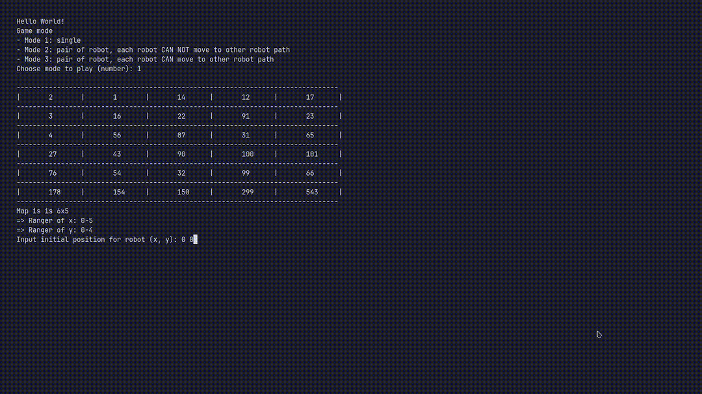

# Important Notice
Please note that this program is intended for educational purposes only. It is not meant to be copied and submitted as your final exam project or any other graded assignment. You are encouraged to learn from this code and use it as a reference to build your own unique implementation.
# Game Modes
 
Mode 1: Single Player Mode
In this mode, a single robot can move freely across the grid.
The robot cannot move to a grid position it has previously occupied.

  
Mode 2: Pair Mode with Restricted Paths
In this mode, two robots are present on the grid.

Each robot has its own path and cannot cross over to the other robot's path.
Additionally, each robot cannot move to a grid position it has previously occupied.
  
Mode 3: Pair Mode with Unrestricted Paths
In this mode, two robots are present on the grid.
Each robot can move across the entire grid, including the other robot's path.
However, each robot cannot move to a grid position it has previously occupied.

# Instructions
Before running the program, make sure you have an input file named input.txt in the same directory as the program. This file will contain the input data for the program.
Compile and run program. If you have gcc you can compile and run program like this:
```
g++ main.cpp -o main
./main
```
All robot output will be recorded in an output file named output.txt. The file will be created (if not already present) and the output will be appended to it.
    
    

# How
This project utilizes the console output and basic animation techniques to represent the grid and robot movement. The program uses simple clear console functions that support both Linux and Windows environments, allowing the grid and robot movements to be displayed cleanly.
The program draws each frame of the grid using a function and incorporates delays using the sleep function to allow for step-by-step tracking of the robot's movements.
To learn more about how to make simple console animation you can check out this [simple program](http://paste4btc.com/Lu9Cvpd9).

# License
This project is released under the MIT License.
